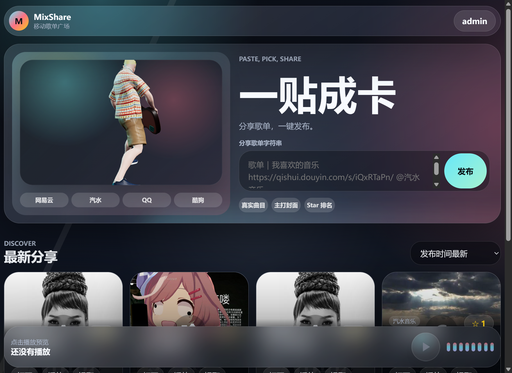

# MixShare 音乐歌单分享社区

MixShare 是一个基于原生 Node.js、HTML、CSS 和 JavaScript 的音乐歌单分享项目。用户可以粘贴来自网易云音乐、汽水音乐、QQ 音乐、酷狗音乐等平台的歌单分享文本，解析真实曲目，选择主打封面并发布到发现页。

首页使用 Three.js 加载本地 GLB 模型，展示一个抱着吉他跳舞的小人。模型会循环播放自带动画，并支持鼠标在封面区域内横向移动时进行 360 度旋转预览。

## 项目截图



## 功能特点

- 歌单分享文本发布与解析
- 发现页歌单展示和收藏排序
- 本地账号登录状态
- 音频预览播放器和底部可视化条
- Three.js 本地 3D 模型渲染
- 模型自带动画循环播放
- 鼠标跟随 360 度旋转交互
- Docker 和 Docker Compose 部署

## 技术栈

- Node.js 原生 HTTP 服务
- HTML / CSS / JavaScript
- Three.js + GLTFLoader
- GLB 3D 模型资源
- Docker

## 目录结构

```text
.
├── app.js
├── data.json
├── docker-compose.yml
├── Dockerfile
├── hero-model.js
├── index.html
├── read.md
├── server.js
├── styles.css
├── assets/
└── model/
    ├── source/
    └── textures/
```

## 本地运行

确保已经安装 Node.js，然后在项目根目录执行：

```bash
node server.js
```

默认访问地址：

```text
http://127.0.0.1:8090
```

如果需要指定端口或监听地址：

```bash
HOST=0.0.0.0 PORT=8090 node server.js
```

Windows PowerShell：

```powershell
$env:HOST="0.0.0.0"
$env:PORT="8090"
node server.js
```

## Docker 部署

### 方式一：使用 Docker Compose

推荐使用这种方式，`data.json` 会挂载到容器里，方便保留发布数据。

```bash
docker compose up -d --build
```

访问：

```text
http://127.0.0.1:8090
```

查看运行状态：

```bash
docker compose ps
```

查看日志：

```bash
docker compose logs -f
```

停止服务：

```bash
docker compose down
```

### 方式二：使用 Docker 命令

构建镜像：

```bash
docker build -t mixshare .
```

运行容器：

```bash
docker run -d --name mixshare -p 8090:8090 -e HOST=0.0.0.0 -e PORT=8090 mixshare
```

停止并删除容器：

```bash
docker stop mixshare
docker rm mixshare
```

## 更新部署

代码修改后，重新提交并推送：

```bash
git add .
git commit -m "Update MixShare"
git push
```

服务器上拉取最新代码后重建容器：

```bash
git pull
docker compose up -d --build
```

## 注意事项

- 项目会读写根目录下的 `data.json`，Docker Compose 已经将它挂载为持久化文件。
- 3D 模型文件位于 `model/source/Guitar (1).glb`。
- Three.js 当前通过 CDN 加载，部署环境的浏览器需要能够访问 `https://unpkg.com`。
- 默认服务端口是 `8090`，可以通过 `PORT` 环境变量修改。
